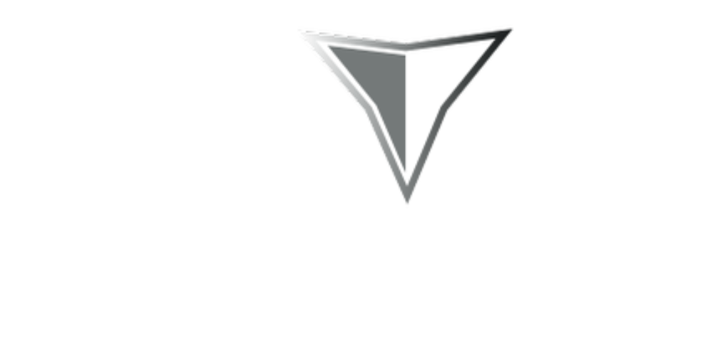

# 🎬 Vedere Films

<div align="center">
  
  
  [](https://nextjs.org/)
  [](https://reactjs.org/)
  [](https://www.typescriptlang.org/)
  [](https://tailwindcss.com/)
  [](https://www.framer.com/motion/)
</div>

## 📝 Sobre o Projeto

Vedere Films é um site criado para fins lucrativos, Desenvolvido com as mais recentes tecnologias web, oferece uma experiência de usuário fluida e responsiva.

### ✨ Características Principais

- 🎯 Interface moderna e intuitiva
- 📱 Design totalmente responsivo
- ⚡ Performance otimizada
- 🎨 Animações suaves e profissionais
- 🔍 Busca avançada de filmes

## 🚀 Tecnologias Utilizadas

- **Next.js 14**: Framework React para renderização híbrida
- **React 18**: Biblioteca JavaScript para construção de interfaces
- **TypeScript**: Superset JavaScript com tipagem estática
- **Tailwind CSS**: Framework CSS utilitário
- **Framer Motion**: Biblioteca para animações
- **ESLint**: Linter para manter a qualidade do código
- **PostCSS**: Processador CSS

## 🛠️ Instalação

1. Clone o repositório:
```bash
git clone https://github.com/jacsonpedrotti/vedere-films.git
cd vedere-films
```

2. Instale as dependências:
```bash
npm install
# ou
yarn install
```

3. Inicie o servidor de desenvolvimento:
```bash
npm run dev
# ou
yarn dev
```

4. Acesse `http://localhost:3000` no seu navegador

## 📁 Estrutura do Projeto

```
vedere-films/
├── src/
│   ├── app/          # Páginas e rotas da aplicação
│   ├── components/   # Componentes React reutilizáveis
│   ├── styles/       # Estilos globais e configurações
│   └── utils/        # Funções utilitárias
├── public/           # Arquivos estáticos
└── ...
```

## 🎨 Design e UX

O projeto foi desenvolvido com foco em uma experiência de usuário excepcional:

- Design minimalista e moderno
- Animações suaves usando Framer Motion
- Layout responsivo para todos os dispositivos
- Paleta de cores harmoniosa
- Tipografia otimizada para leitura
- Feedback visual interativo

## 🤝 Contribuindo

Contribuições são sempre bem-vindas! Para contribuir:

1. Faça um Fork do projeto
2. Crie uma branch para sua feature (`git checkout -b feature/AmazingFeature`)
3. Commit suas mudanças (`git commit -m 'Add some AmazingFeature'`)
4. Push para a branch (`git push origin feature/AmazingFeature`)
5. Abra um Pull Request

## 📄 Licença

Este projeto está sob a licença MIT. Veja o arquivo [LICENSE](LICENSE) para mais detalhes.

## 📧 Contato

Jacson Pedrotti 

Link do Projeto: <a href="https://vedere-films.vercel.app" target="_blank">https://vedere-films.vercel.app</a>

---

<div align="center">
  <sub>Desenvolvido por <a href="https://github.com/jacsonpedrotti">Jacson Pedrotti</a></sub>
</div>
